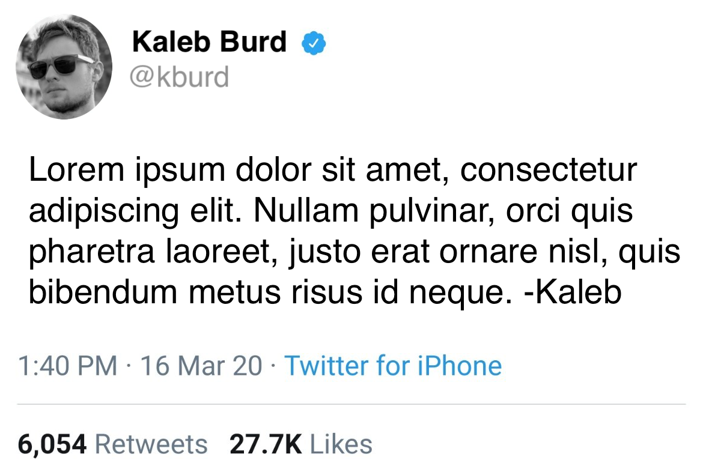
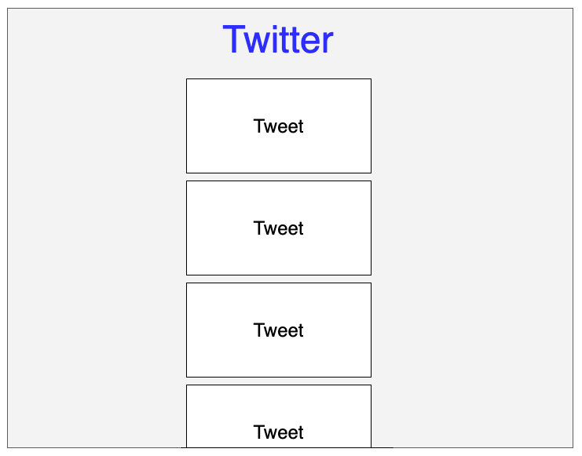

# Twitter Clone Lab

## Description
You will create your own version of Twitter! After completing each bullet point in the requirements, you should commit and push your changes.

## Setup
1. Fork this repository
2. Clone your repository to your local machine `git clone`
3. Open the project in your text editor
4. Create HTML, CSS, and JavaScript files in the root directory

## Requirements

### Part 1
Read in tweet data provide in `data.js` and render the information as tweets. The file `data.js` consits of an array of objects. Each object should be rendered as a tweet on the screen and all the tweets should be rendered in a list.

### Part 2
Make a REST call using AJAX to get tweet information rather than the `data.js` file. You can expect the response data to be in the same form as `data.js`.

## Mockups
### Tweet

### Webpage

### Submission
Create a pull request from your project GitHub page

**Happy Hacking!**

